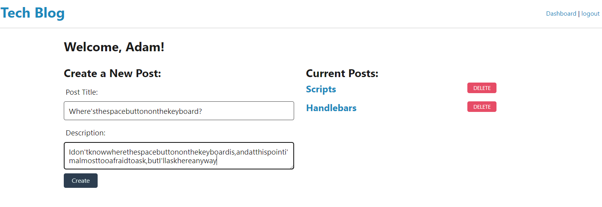
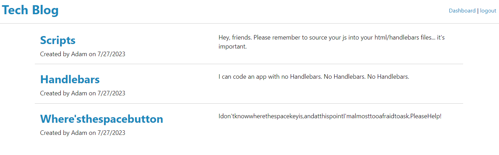

# MVC Tech Blog
 
  
 
  ## Table of Contents
  
  [Description](#description)

  [Installation](#installation)
  
  [Usage](#usage)

  [Contribute](#contribute)

  [Test](#test)
  
  [Credits](#credits)
  
  [License](#license)

  [Questions](#questions)
  
  ## Description
  This is a blog that allows users to create and account and post thoughts and discoveries about technology to the other users. 

  ## Installation
  Being deployed on Heroku, there are no other steps required to use the application.

  ## Usage
  When visiting the landing page, users can view all posts that have been added to the application's database. When the click the Login button in the top right corner of the screen, they can either log in if they are an existing user, or create an account. Creating an account will also log them in. While logged in, users can go to their dashboard where they can add new blog posts, as well as edit any of their own blog posts. Clicking on the application's header in the top left of the corner will return them to the list of all blog posts from all users.

  
  

[Heroku Deployment: (https://github.com/AdamJohnson92/MVC-Tech-Blog)]

  
  ## Contribute
  
  [GitHub Repo: (https://github.com/AdamJohnson92/MVC-Tech-Blog)]
  
  ## Credits
  Much of this code came from inclass examples of unit 14 of BCS FullStack Flex Bootcamp about MVC. All of the style for the page come from the mini project  in the unit, as well as the foundation for the models, the Handlebars views, and the routing controllers. Additional assistance in making sure that the functionality of updating a post is courtesy of BCS tutor Faran Navazi.

  ## License
  
  
  
  This project uses Express.js, Sequelize, MySQL2, and bcrypt, which are licensed under the terms of the MIT license.

  ## Questions?

  Contact me at:

  GitHub: https://github.com/AdamJohnson92
  
  email: adamgjohnson92@gmail.com